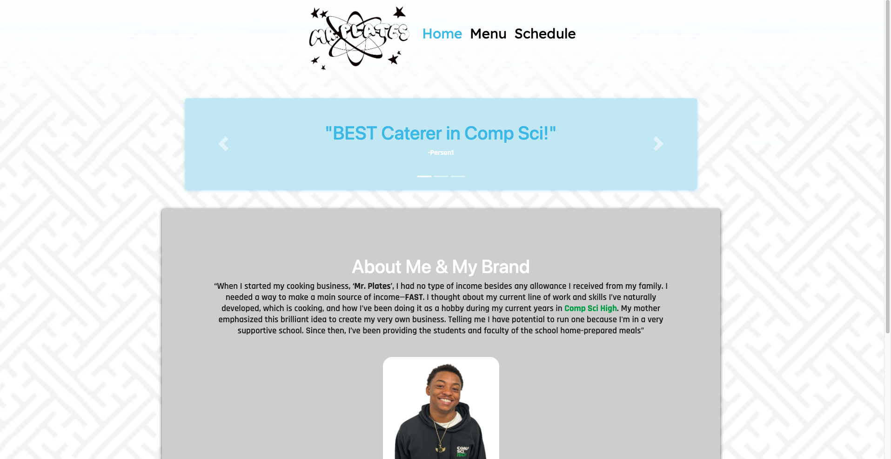
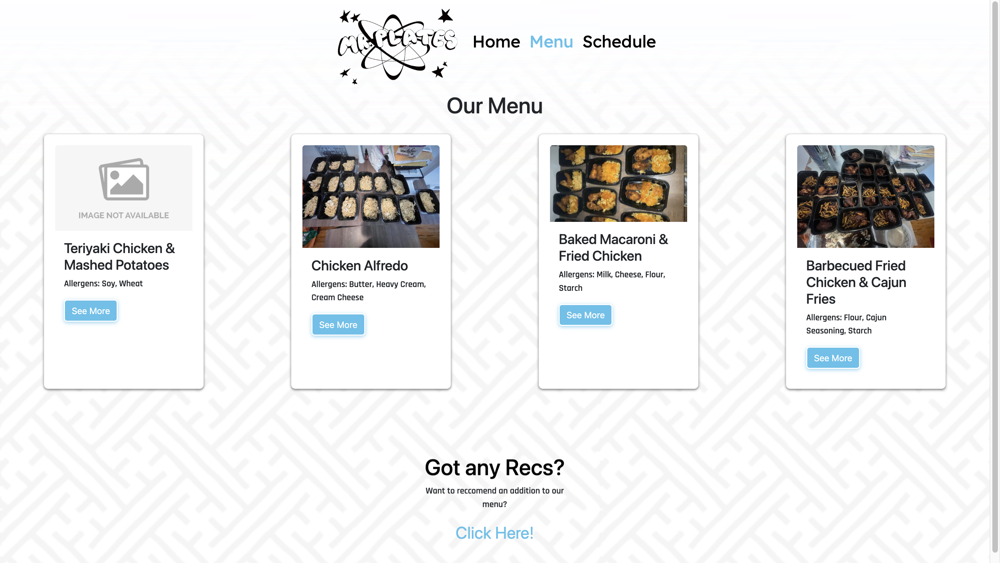
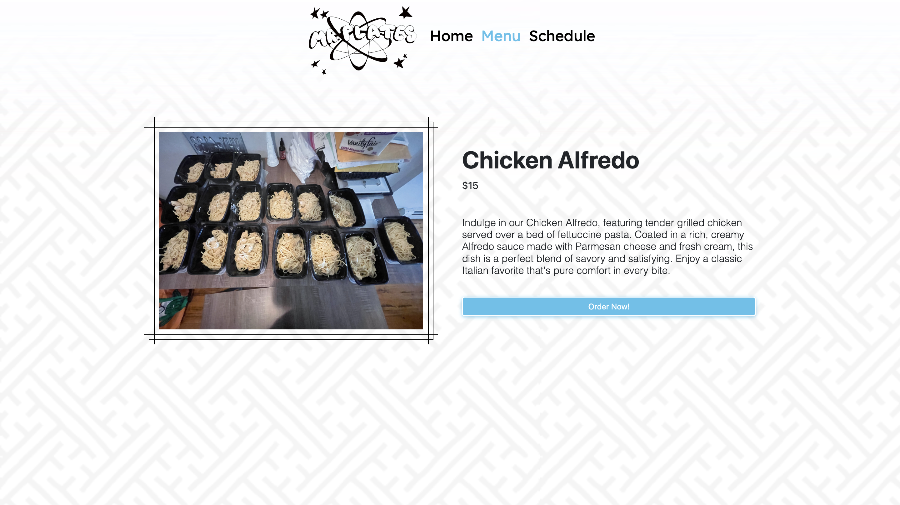
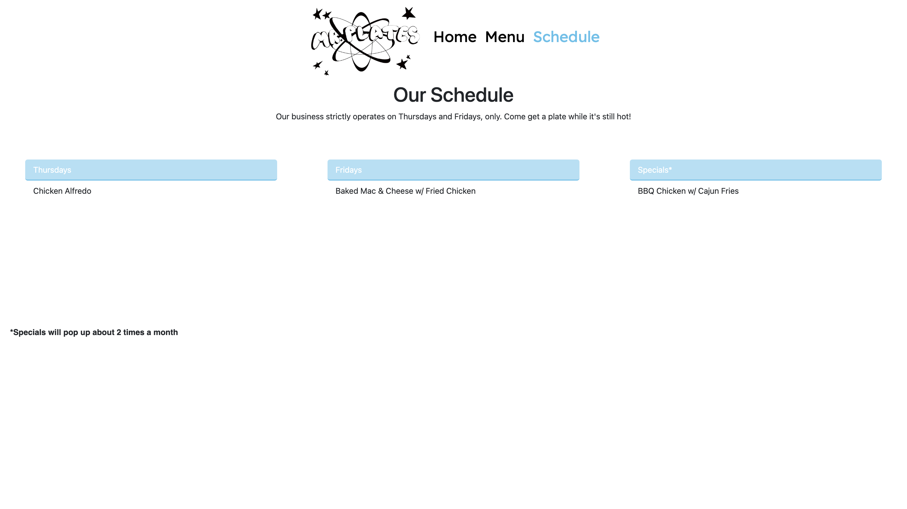
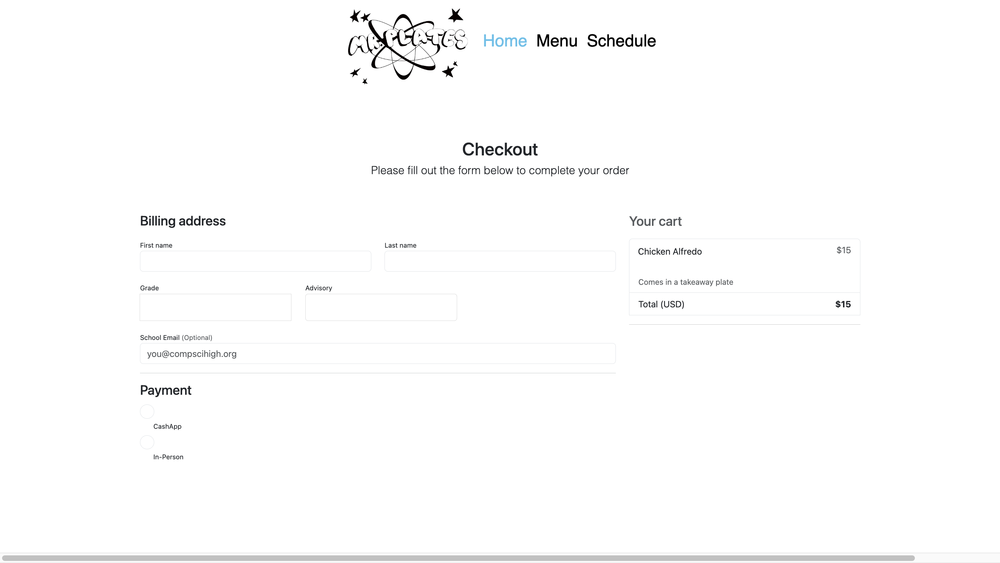
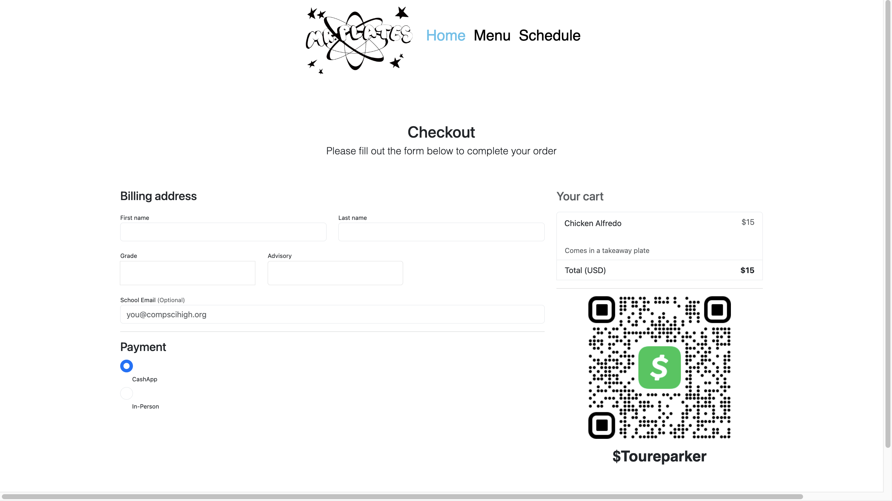
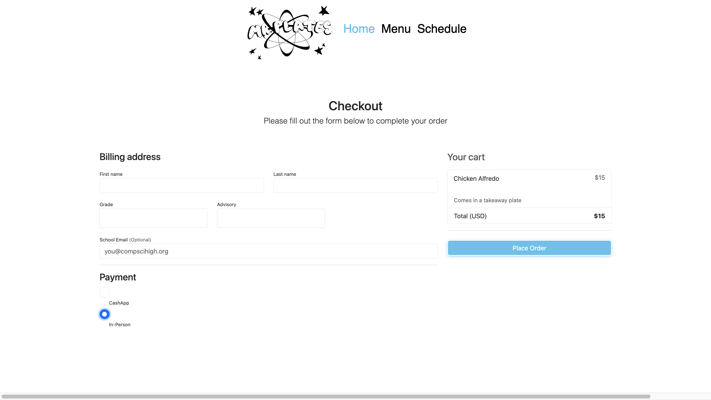
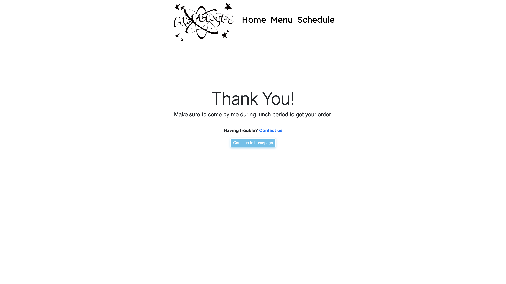
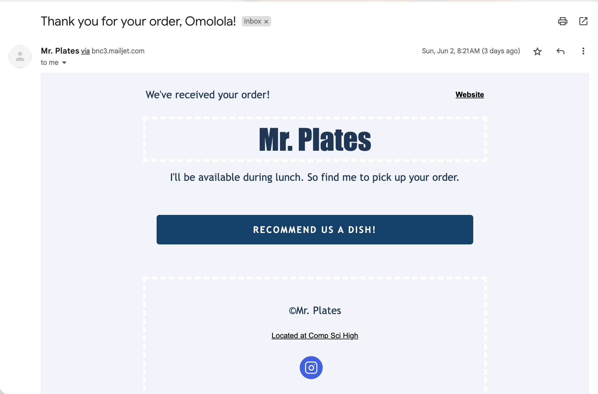

# **Mr. Plates** #

## Toure's Catering Website ##

Toure's website includes a:

- **Home Page**
>Testimonies:
>> It displays the testimonies and praises that Toure has been commended for.
>
>Bio:
>> Displays an biography of Toure and the process of his start up. 
>
>Footer:
>>The user can get help and send an email, or open his instagram page
>
- **Menu Page**
>The user will be able to see what options are offered on the menu
>
>They also have access to a google forms in order to add menu item reccomendations (Form is at the bottom of the page)
- **Schedule Page**
>The user will be able to see what options are offered on the menu and on which day it will be availible
>
- **Admin Page**
>The user will be able to alter/ delete items in the menu
>

## Home Page ##

### How to use ###

- The home page is a static page so it will not change 
  
- **This will display the menu item's and a button that leads you to a details page**
>

## Menu Page ##

### How to use ###

- The menu page is a dynamic page so it will change based on the database's information
- **This will display professional information about Toure**
>

## Schedule Page ##

### How to use ###

- The schedule page is a static page so there is nothing needed to change 

- **This will display days (between Thursday and Friday) that each item is being sold**
>

## Item Information Page ##

### How to use ###

- The item information page is a dynamic page, so it will chnage based on the items individual data

- **This will display the item's price, name, description, and an order button**
- **When the user clicks on the order button, they are directed to the checkout page**
>

## Order/Checkout Page ##

### How to use ###

- The checkout page is a dynamic page so the prices will change based on the item

- **When the user preceeds on the item info page, they will be led here.**
- **When the user completes the purchase, they will be led to the order confirmation page, and have an email sent to them simultaneously**
>

- **When the user chooses the "Cashapp" radio button, the screen will display Toure's Cashapp tag**
- **Then the user can press the complete order button to finalize**

- **When the user chooses the "In-Person" radio button, the screen will display a place order button that finalizes order**

- ***This is what the confirmation page looks like***

- ***This is what the users email should look like once recieved***

## Admin Page ##

### How to use ###

- The admin page, for adding items, is a static page. The admin page for editign/deleting items is dynamic

- **Toure (admin), will be met with a page where they can add an item for the menu**
>

## **Notes to Consider** ##

### How to use ###

- The home page is a static page so there is nothign needed to change usign back end code

- **This will display professional information about Toure**
>

